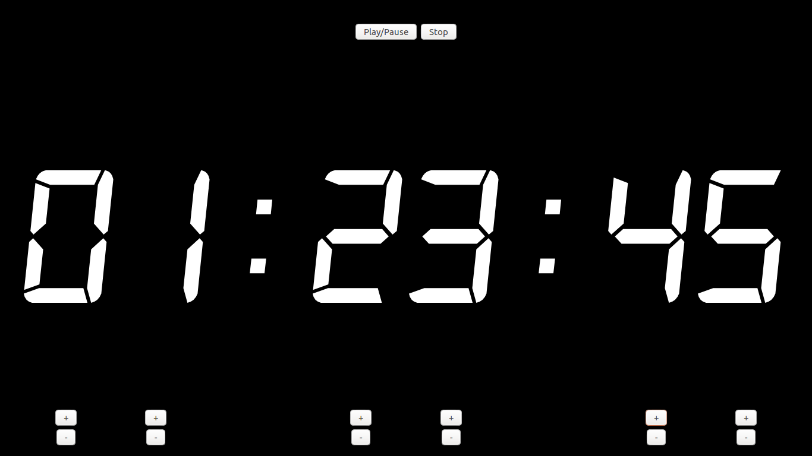
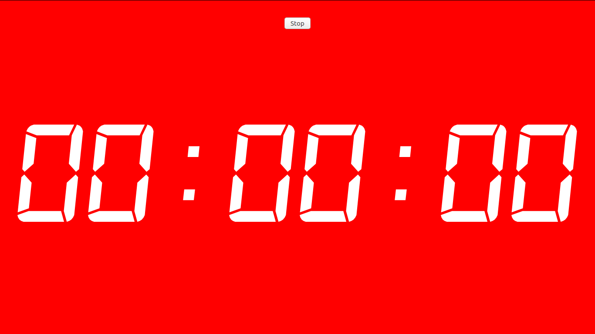

# Semaforo

A lightweight, simple, offline and straight-to-business countdown timer for presentations.

### ⚡ [Try it here](http://mexomagno.github.io/Semaforo/)

## Features:

* Led segment-like digits
* Pause button
* Per-digit time set
* High visibility

## Usage:

1. Download project and unzip
1. Open the html file in your favorite browser
1. Use controls to set time and start
1. Done

You **don't need** to have an internet connection. 

## Preview:

### Idle screen:

### Setting time:

### Time up:

